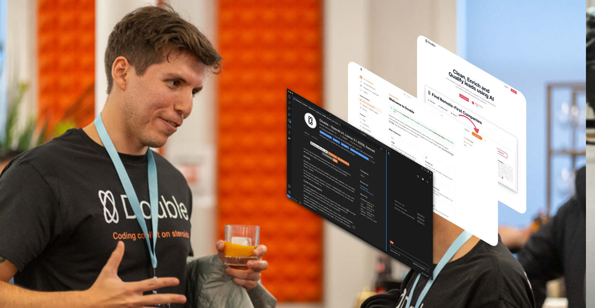
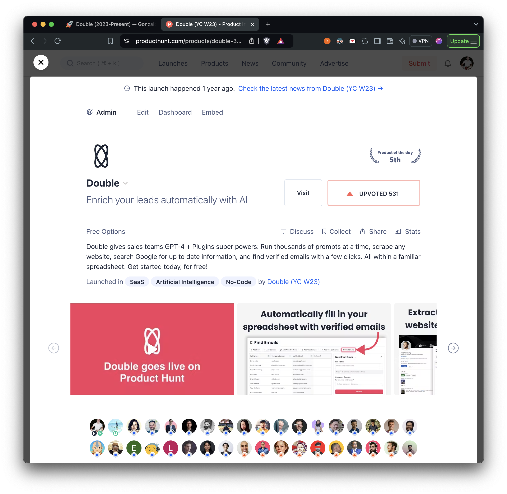
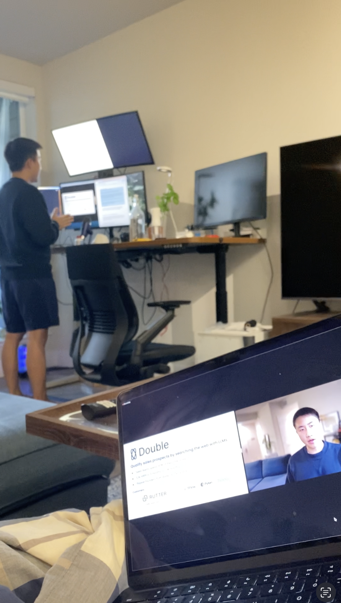
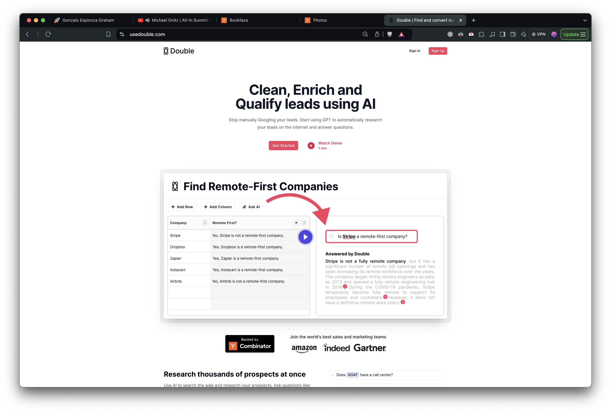
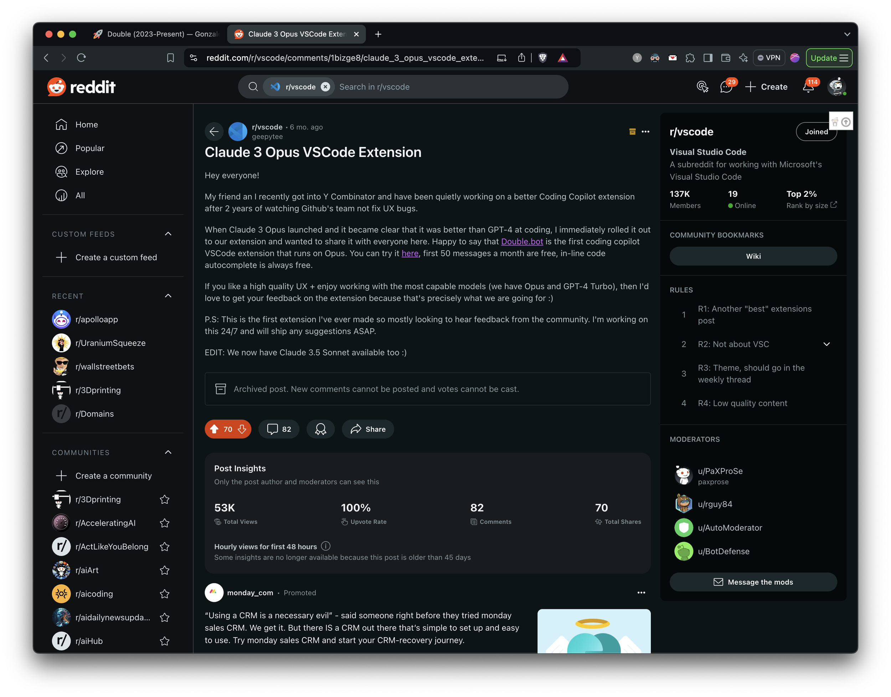
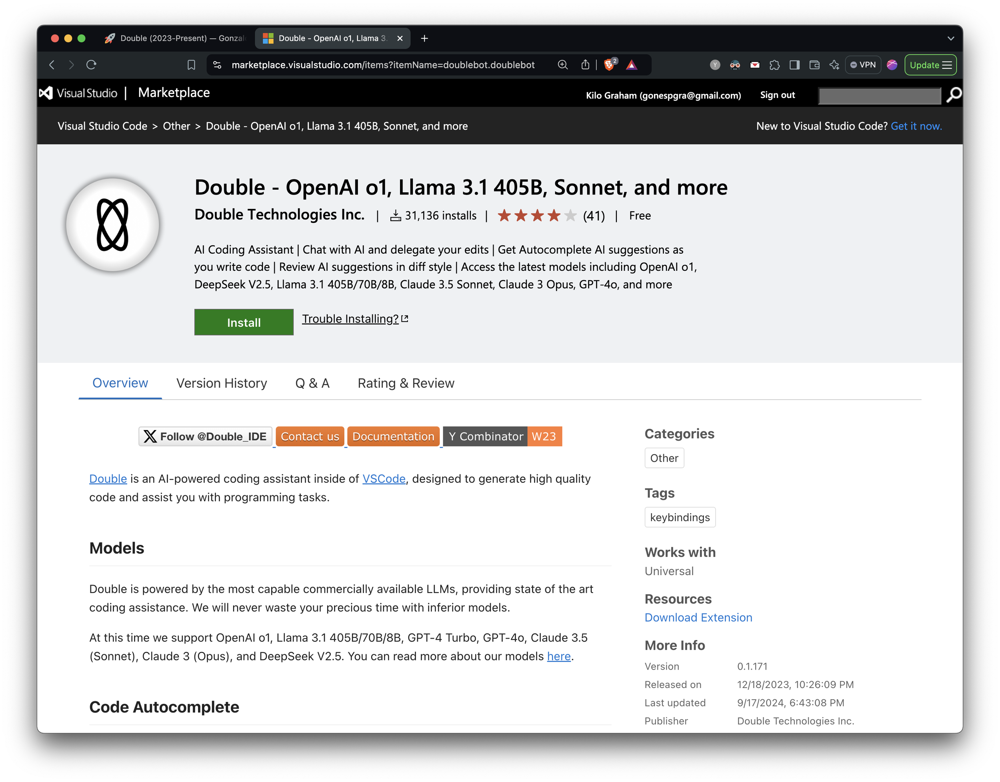

During the holidays in 2022, I reconnected with [Wesley](https://x.com/WesleyYue) who was my co-founder at [Caravel Robotics](Caravel_Robotics_2021.html) and [Ninja Delivery](Ninja_Delivery_20212022.html), he was looking to start a new company. If you’re not familiar with the time period, ChatGPT launched on November 30, 2022. The world was awakening to the potential of generative AI and large language models, and even though we had played around with GPT-2 back in the Ninja days, we never felt like dropping everything to pursue it. This time around, it was obvious that the right thing to do was to drop everything and pursue what I believe is an opportunity akin to the creation of the internet.

We got into the Y Combinator Winter 2023 batch with a “spreadsheet with AI” idea. Back in the Ninja days, we faced some challenges with managing inventory across our different warehouses, having to place daily resupply orders, and having to keep the SKU names and descriptions accurate. All of those tasks were low leverage but were hard to automated, as they required small bits of decision making. At Ninja, our solution was a small team of virtual assistants from overseas, but with davinci-003 it was possible to automate a lot of these decisions in a spreadsheet, so we built that.

Back then the hype was so high that you could tweet any scrappy demo and get a ton of engagement and sign-ups, and so we did some tweeting and some commenting on HackerNews and within no time got over 1,000 sign-ups on our waitlist. The demo was basically Google Sheets but instead of formulae, you could write prompts and have davinci-003 generate responses into multiple cells at once (as far as I know, the first instance of bulk LLM generations). The pitch built on this idea that, at the time, the AI products with the most traction were around word processing (i.e Copy AI, Jasper, etc) but in the old software paradigm, Excel was a much more valuable tool than Word, and so in the new AI paradigm we should actually focus on building AI Excel.

I’m skipping some steps here but we eventually talked to everyone in our waitlist and network who would entertain a discovery call, and narrowed down the groups of people who would be willing to pay for this spreadsheet. The most motivated appeared to be sales teams who wanted to use it for lead generation, enrichment, and qualification. This is how [https://usedouble.com/](https://usedouble.com/) was born ([Archive link](https://archive.is/hiJ8r) just in case).

  <figure class="media-figure"></figure>
  <figure class="media-figure"></figure>
  <figure class="media-figure"></figure>

<u>Left:</u> Our Product Hunt launch scoring 3rd place for the day. <u>Center:</u> Wesley, my co-founder pitching usedouble.com at the YC W23 demo day. <u>Right:</u> Final usedouble.com landing page.

There are many thinks to be said about this first product that we launched. This is the first time I write about a software project and I don’t think listing everything we tried would be useful, or listing our lessons would be helpful (without the full context). Once again, I’m going to jump ahead and let you know that we end up pivoting from this product roughly a year in.

If I had to summarize some of the biggest takeaways from this first product, I’d say that I highly advise against building companies in areas where you have no domain expertise and a deep interest (before this I knew nothing about sales, and can’t say I had a natural passion for it). I also advise against free tiers, having low prices, and competing on price (most of our MRR growth came after our YC partner, [Jared](https://x.com/snowmaker), told us to switch to B2B sales and start charging 3 digits per month. Our chart started pointing up overnight, it was night and day). Lastly, know what industry you’re getting into, lead enrichment is a super competitive space with no barriers to entry, where people drag their feet if you make them pay for than 10 cents for a lead.

For a way more detailed write-up on why we pivoted, I’ve written about it [here](https://docs.double.bot/blog/pivot) ([Archive link](https://archive.is/BgXoe) just in case). As the title suggests, we grew it to $5k MRR in a decent amount of time. If you want to dissect more about the story, you can also see our [Product Hunt launch](https://www.producthunt.com/products/double-3) (ranked #3 for the day, which took a lot of growth hacking and 24 hours of no sleep), our original [Launch YC post](https://www.ycombinator.com/launches/IJF-double-internet-capable-gpt-bots-to-automate-repetitive-work), and my original [launch tweet](https://x.com/geepytee/status/1636066726973702149). If you’re building in this space, hit me up, always happy to chat about our experience.

So why pivot? The decision came after a couple of months working with some big name B2B customers. We had decided that lead enrichment on its own was not a big enough opportunity, so we started also managing outbound campaigns for them, with the hypothesis being that our AI enriched data would allow us to write better personalized emails automatically at scale, and therefor conversion rates would jump. This was’t the case and we were performing on par with the template emails that the sales orgs were using before us. During this time, we also started doubting whether this was the biggest opportunity to pursue in the era of AI, and if perhaps there was something better aligned with our interests (founder-product fit they call it). We started experimenting with a lot of ideas (this is what led to the [Messi tweet that went mega viral](https://x.com/geepytee/status/1721705524176257296)) and eventually narrowed down on our favorite tool at the time: AI coding copilots.

\*Note: If you want to see how usedouble.com worked, there are some archived tutorials [here](https://www.youtube.com/playlist?list=PL55VZ7oDEoRmFhwtCxBuHGxR-2N6K9z6Y). This was not the final version but it shows the basic idea.

  <figure class="media-figure"></figure>
  <figure class="media-figure"></figure>

<u>Left:</u> One of our launch posts on Reddit with hundreds of upvotes and comments. <u>Right:</u> Our VS Code marketplace extension page with over 30,000 installs.

The main motivation for working on AI coding tools (which is super cliche, as most developers love building developer tools) was that the biggest tool at the time, GitHub Copilot, was fully of bugs and the GitHub team was not moving fast towards fixing them. There were super upvoted GitHub issues unanswered that were over a year old. We’ve written about it [here](https://docs.double.bot/copilot) ([Archive link](https://archive.is/ze9yh) just in case). The other motivation was that AI coding copilots was a rapidly growing market, and from what we could tell at the time it was likely the AI application with the most traction (in $ amount).

We are still working on this second product so I can’t tell you how this story ends and I won’t go over all of the learnings, instead you can check it out yourself: [https://double.bot/](https://double.bot/) ([Archive link](https://archive.is/ujVg7) just in case)

The one thing I will say is that we had a super successful launch and quickly overcame out last product in terms of MRR, which validated the pivot. We lined up the launch of our VS Code extension with the launch of Anthropic’s Opus model. We didn’t really know it was going to become the best coding LLM at the time so there was a bit of luck, but essentially Double was the first coding copilot in the world to offer Opus for free. The best part was that we had access to Opus thanks to being a YC company, while most people didn’t, and Twitter was getting filled with demos of Opus generating amazing code. People had to come to us to access Opus, and this got us our first 20,000 installs in a matter of weeks. This is a strategy that we’ve replicated with Llama 3.1, GPT-4o, Claude 3.5 Sonnet, OpenAI o1-preview, and we’ll probably keep replicating it because it keeps on winning. We are always the first to ship the new models, speed is the moat.
